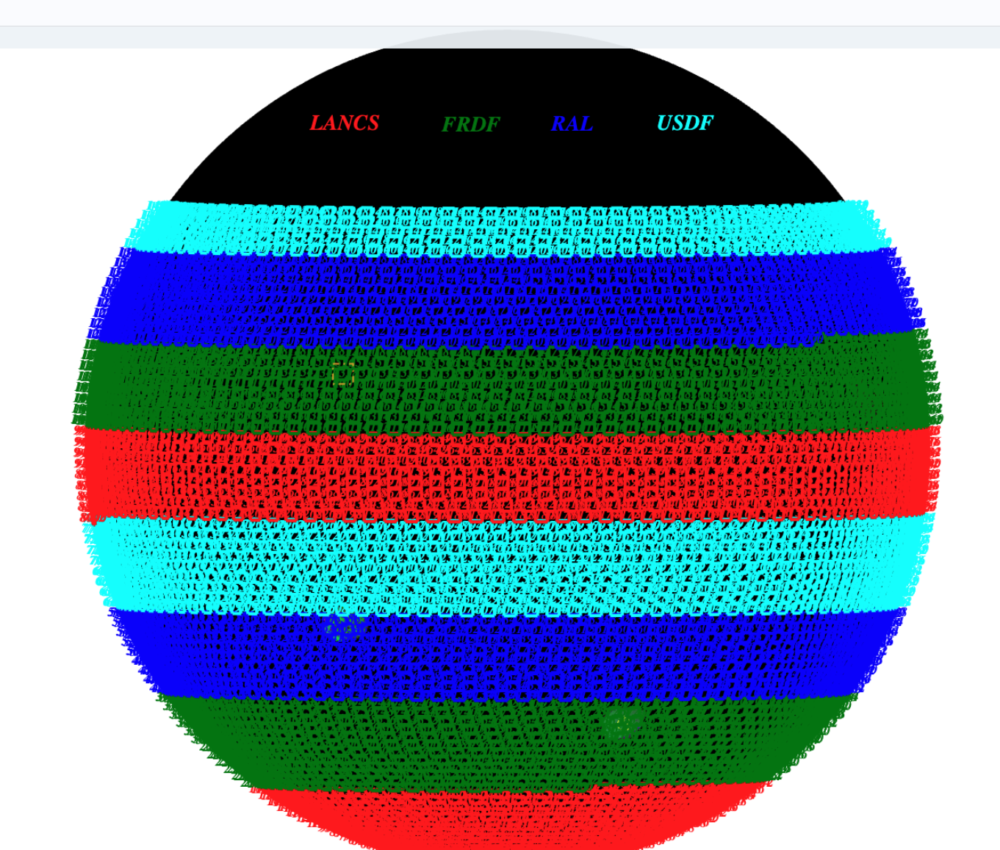
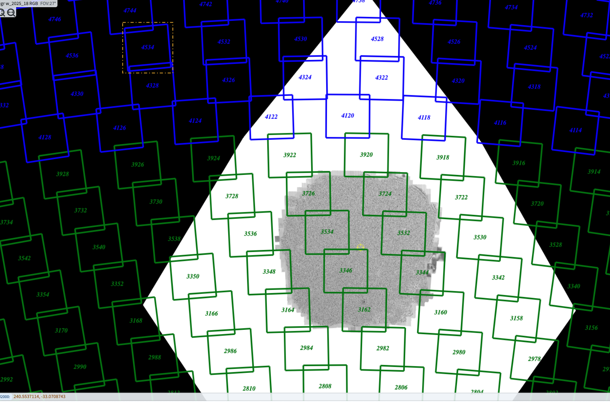
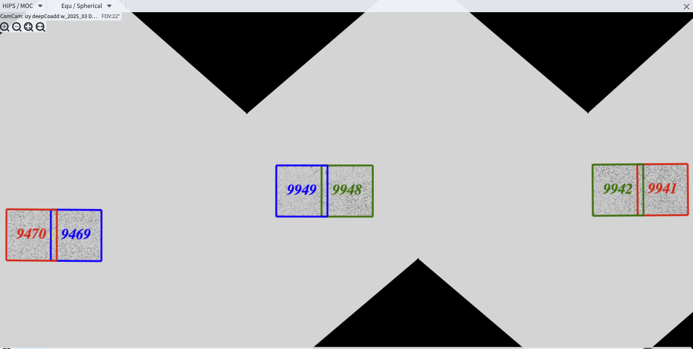

# Multisite Data Release Processing

```{abstract}

Data Release Processing (DRP) for Rubin has the goal of producing a
cumulative (re)processing of all science-quality exposures in the 
LSST footprint (up to 25,000 square degrees) into deep_coadd 
images in six bands, with tables of detected and measured objects 
and their properties, along with tables of sources across multiple 
epochs that go into object.

Rough estimates based on early DRP campaigns shows that, to complete
an annual DRP within 200 calendar days will require more than 
20K dedicated cores (with 6 GB RAM/core), up to 25 PB of storage,
and fast, reliable network connections as well as significant optimization
of several key science algorithms.

Since a single DF may not have all the required resources to turn around
a DRP in the allotted time, a multisite processing system is planned
to distribute the compute load over (currently) four data facilities.

We describe details of early tests of the multisite processing system.

While most stages of the processing may generally be run in parallel for each 
single-epoch exposure or coadd tract, there are stages of the 
processing where intermediate results are brought together (fan-in) for 
a 'global fit or summary' and then the results distributed (fan-out) for 
continued work.

These tests hope to demonstrate the feasibility of multisite production 
for Rubin DRP.
```

## Purpose of running this test

To enable multisite DRP to move forward, it must be shown that:

1. Raw exposure and calibration (and ancillary) data as well as processing
codes can be distributed to all data facilities (DFs) involved 
efficiently and automatically.  It should be possible to verify that input
exposures and output data products are not lost.

2. Data can be simultaneously processed at each DF in a reasonable amount
of time, within the allocated resources.

3. Processed data products and quality metrics can be returned to a central
DF (USDF) for archival (i.e. to tape robot), quality and science analysis 
and further distribution (i.e. to IDACs).

4. The scientific results obtained from processing should not be 
site-dependent (within reasonable tolerance).  Some small fraction
of the data may be processed at multiple sites.

5. Launching and monitoring of current status of processing at each site 
and overall DRP campaign status can be managaged by the 
(distributed) Campaign Management team.


## Requirements for a DRP 


## Experience from past DRP campaigns

Previous DRP campaign metrics   with similar stack pipelines:

|DRP|  RTN|     Year Mos|      visits| det/visit|  tracts | steps/stages |   core-hours|  storage| days|
|DC2 |   |     2 days  |       300|      150|             2|             steps 1-7 |         5K|               10TB|        2d|
|RC2  |    |   3 days  |      423|      100|   3|             steps 1-7|        10K |             25TB|         3d|
|DP1 | |    3 days |       1800 |         9 |  22 |           steps 1-7|   10K|              25TB |        3d|
|DP0.2|      rtn-039|  2022 1-6|      20K|      150|           150|        steps 1-7 |         2.5M|              2.5PB   | 180d|
|PDR2 |       rtn-063| 2023 5-9|      14K|      100|           400|         steps 1-7|         1.5M|              2.5PB|    120d|
|LSSTCam DRP |       DM-51284| 2025 6|      3000|      162| 100|         stages 1-4|         0.5M|              700TB|    15d|
(projection)
|DR    1 |            |         2026 1-9|     240K|     189|         8000|        stages 1-4|       40M|               50 PB|    150d|
|DR    2| |             2027 1-9|     500K|     189|       10000|        stages 1-4 |      80M |             100 PB|   300d|

|DF| Site | cores | GB/core |Storage | Fraction of DRP | Notes|
|USDF | SLAC | 6000 | 4 |10 PB | 0.35| |
|FRDF|IN2P3 | 3000 | 8 |5 PB | 0.40| |
|UKDF|LANCS | 1000 | 4 | 300 TB | 0.10 ||
|UKDF|RAL| 3000 | 4 | 5 PB |0.15 | |

<figure>
  
  <figcaption> Possible assignment of survey tracts to DFs </figcaption>
</figure>

<figure>
  
  <figcaption> Close up showing subset ring of tracts assigned to FRDF for processing </figcaption>
</figure>

In order to run a full years worth
of data from the LSST camera, while also keeping up with the nightly
data production we will need to use the data facilities in France
(IN2P3) and the UK Rutherford (RAL) and Lancaster (LANCS). The test we
ran as our proof of concept was to take 6 patches of the sky from the
HSC dataset.  Placed the data for 2 patches at each of the 3 sites.
We have a well defined pipeline of data that we run that has a
combination of running on individual patches, and then doing overall
calibration, and then goes back to running the individual patches.  We
excersise this at 1 site on a bi weekly basis while testing the
software stack.  This test is being done to do a proof of concept,
that we can run data in this manner, and to help us to find any holes
in our logic early in the process so we can better design a way of
automating this enite process.  It should be noted that we moved the
biweekly pipeline software validation to the remote sites early in
January 2025 to free up cores at the USDF and to familiarize ourselves
with running data remotely and moving output datasets back to the USDF
and injesting them into the USDF butler.

## What data are we using
@brian; How did you pick the fields that we
are using for the 3X3?  I can give the fields and insert pretty
pictures but where they "randomly selected" or did you have a reason
for picking those particular fields?  Or maybe I just put this
question into the rtn and let you answer it 6 patches were selected
from the HSC dataset for this test, and the data was put at each of
the remote sites. The patches at the sites overlap with the patches
that are at that site but not with the patches at the other sites.
This proceedure allows us to excersise the process of moving the data
and verifying that we understand what

We used the pipeline diagrams
https://tigress-web.princeton.edu/~lkelvin/pipelines/current/drp_pipe/HSC/DRP-Prod/
to determine what inputs we needed to have on disk at each site, and
what data needed to be moved between sites for the calibration steps,
and after calibration what data needed to be moved back to the sites
to continue processing.  We also talked to pipelines to deterimine
what the minimum dataset outputs needed to be moved back to SLAC for
validation.

## Moving Raw Data into place Yanny

## setting up Butler repositories Yanny

Determining we have all input
## data in place Yanny

Campaign Management and communication Jen

For
 Production, we used the standard RC2 pipline setup that we use for
 weekly validation with different data queries to the butler to grab
 the correct patches out of the butler.  These setups are tested and
 variables are smoothed out in weekly testing over a small dataset.
 We used bps to submit jobs to the PanDa workload management
 system. At this point we do not have the steps daisy chained
 together yet so between each step the Production team took time to
 look at and understand outputs and any potential errors or problems
 that might occur and give feedback to the pipeline teams.
 Communication with the pipeline teams and between the production
 team and the sites happened over SLAC and numerous Zoom calls.


## 3X3 processing across sites – Jen 

Six patches were picked out for our multi site test.  Two patches were
placed at each site.  Steps1, Step2a and Step2b are run on a patch by
patch basis and ran independently at each of the three sites.  Step2c
is an overall calibration step so the required outputs from the
previous steps were moved to SLAC using RUCIO, and injested into the
central butler database and overall calibration was run.  The needed
outputs were moved back to the remote sites using RUCIO and injested
into the remote butlers. Then Step2d, Step2e, Step3, Step4 and Step5
are run.  The outputs are moved back to SLAC for the final overall
calibration and the metrics were run at the remote sites and brought
back.

## Data Product QA - Yanny


<figure>
  
  <figcaption> These are the six tracts chosen for the 3x3 test </figcaption>
</figure>


See the [Documenteer documentation](https://documenteer.lsst.io/technotes/index.html) for tips on how to write and configure your new technote.
