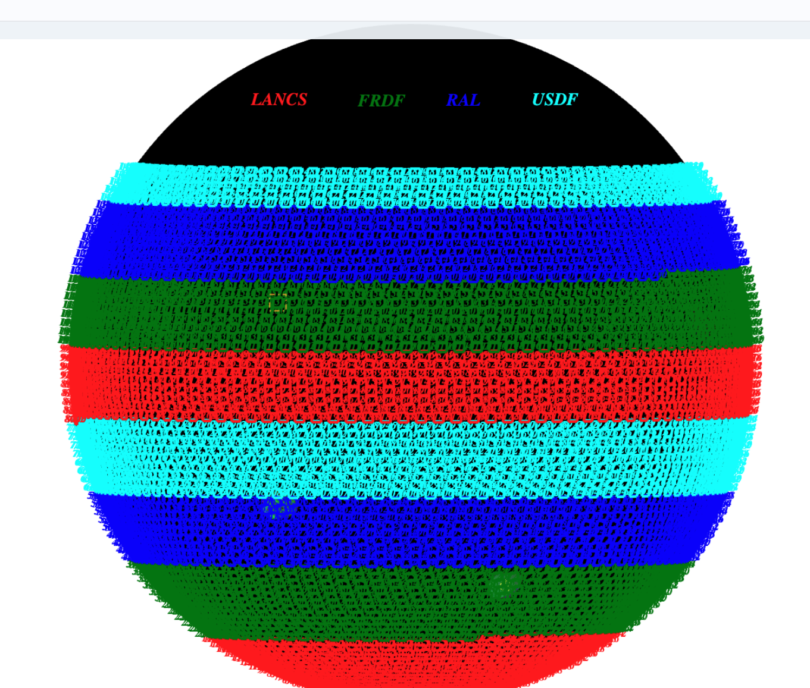
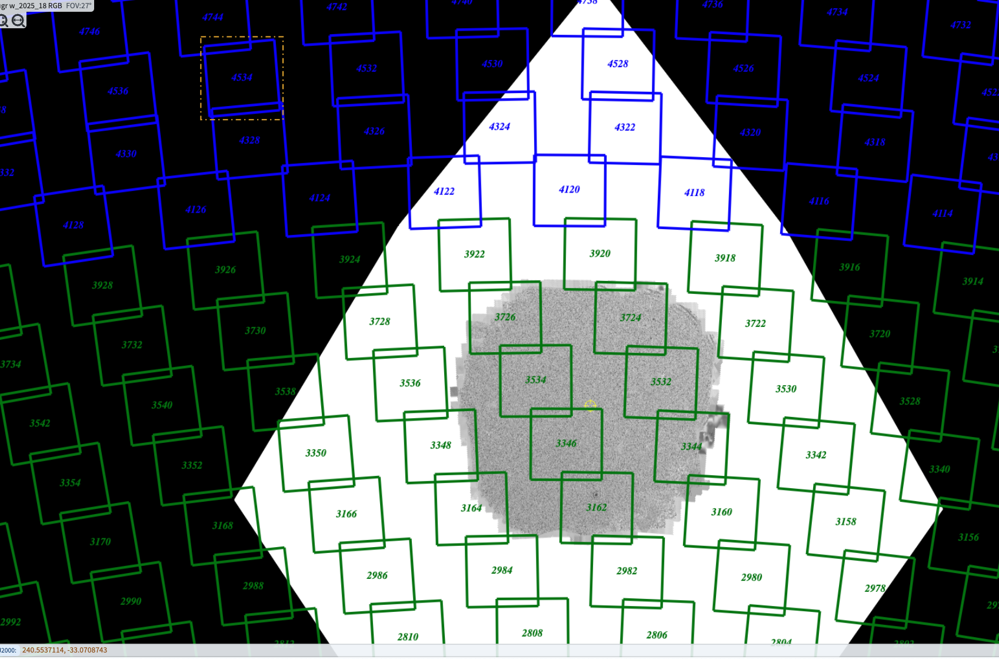
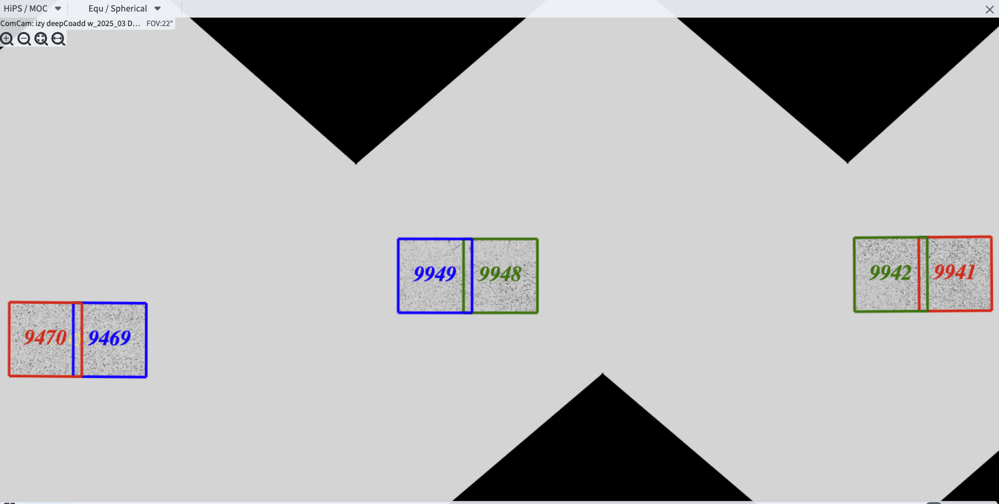

#################################
Multisite Data Release Processing
#################################

Abstract
========

Data Release Processing (DRP) for Rubin has the goal of producing a
cumulative (re)processing of all science-quality exposures in the 
LSST footprint (up to 25,000 square degrees) into deep_coadd 
images in six bands, with tables of detected and measured objects 
and their properties, along with tables of sources across multiple 
epochs that go into object.

Rough estimates based on early DRP campaigns shows that, to complete
an annual DRP within 200 calendar days will require more than 
20K dedicated cores (with 4 GB RAM/core), up to 25 PB of storage,
and fast, reliable network connections as well as significant optimization
of several key science algorithms.

Since a single DF may not have all the required resources to turn around
a DRP in the allotted time, a multisite processing system is planned
to distribute the compute load over (currently) four data facilities.

We describe details of early tests of the multisite processing system.

While most stages of the processing may generally be run in parallel for each 
single-epoch exposure or coadd tract, there are stages of the 
processing where intermediate results are brought together (fan-in) for 
a 'global fit or summary' and then the results distributed (fan-out) for 
continued work.

These tests hope to demonstrate the feasibility of multisite production 
for Rubin DRP.

Requirements for a DRP 
======================

To enable multisite DRP to move forward for Rubin, these rough requirements should be met:

1. Raw exposure and calibration (and ancillary) data as well as processing
codes can be distributed to all data facilities (DFs) involved 
efficiently and automatically.  It should be possible to verify that input
exposures and output data products are not lost.

2. Data can be simultaneously processed at each DF in a reasonable amount
of time, within the allocated resources.

3. Processed data products and quality metrics can be returned to a central
DF (USDF) for archival (i.e. to tape robot), quality and science analysis 
and further distribution (i.e. to IDACs).

4. The scientific results obtained from processing should not be 
site-dependent (within reasonable tolerance).  Some small fraction
of the data may be processed at multiple sites.

5. Launching and monitoring of current status of processing at each site 
and overall DRP campaign status can be managaged by the 
(distributed) Campaign Management team.

Experience from past DRP campaigns, DF specs
============================================

Over the past several years, many small-to-medium scale 
DRP campaigns have been run.  These early DRP campaigns varied in size from
a few hundred to many thousands of visits, covering two to several hundred tracts on the sky.

A tract covers about 2.1 unique square degrees of sky and overlaps neighboring tracts by 10%-20%.

The whole of the Rubin LSST footprint consists of about 15,000 tracts, or 30,000 square degrees on the sky,
of which Rubin may cover 25,000 sq degrees in its wide field survey (ref).

The table gives previous smaller scale DRP campaign visit (30-second exposure) and tract metrics along
with estimates of storage used (no intermediate outputs removed in these totals -- removing intermediates such as warps can 
recover about 1/3 of storage space) as well as core hours and wall-clock days to complete the campaign.
The last two rows of the table show rough metrics for a six month and full year DRP campaign.

.. table:: DRP campaign metrics.

  +----+--------+-------------+------------+----------+---------+--------------+-------------+---------+-----+--------+
  |DRP |  RTN/DM|     Year Mos|      visits| det/visit|  tracts | steps/stages |   core-hours|  storage| days|Where   |
  +====+========+=============+============+==========+=========+==============+=============+=========+=====+========+
  |DC2 |DM-50631|     2 days  |       300  |      150 |        2|    steps 1-7 |         5K  |     10TB|   2d|UKDF    |
  +----+--------+-------------+------------+----------+---------+--------------+-------------+---------+-----+--------+
  |RC2 |DM-50660|   3 days    |      423   |      100 |   3     |     steps 1-7|        10K  |     25TB|   3d| FRDF   |
  +----+--------+-------------+------------+----------+---------+--------------+-------------+---------+-----+--------+
  |3x2 |DM-48353|   2024 12-2 |      800   |      100 |   6     |     steps 1-7|        20K  |     50TB|90d  |UK,FR,US|
  +----+--------+-------------+------------+----------+---------+--------------+-------------+---------+-----+--------+
  |DP1 |rtn-095 |    3 days   |       1800 |         9|  22     |     steps 1-7|          10K|    25TB |   3d|USDF    |
  +----+--------+-------------+------------+----------+---------+--------------+-------------+---------+-----+--------+
  |DP0 |rtn-039 |  2022 1-6   |      20K   |      150 |      150|    steps 1-7 |         2.5M| 2.5PB   | 180d|   US   |
  +----+--------+-------------+------------+----------+---------+--------------+-------------+---------+-----+--------+
  |PDR2|rtn-063 | 2023 5-9    |      14K   |      100 |      400|     steps 1-7|         1.5M|    2.5PB| 120d|   US   |
  +----+--------+-------------+------------+----------+---------+--------------+-------------+---------+-----+--------+
  |DRP |DM-51284|       2025 6|      3000  |      162 |      100|    stages 1-4|         0.5M|    700TB|  15d|US      |
  +----+--------+-------------+------------+----------+---------+--------------+-------------+---------+-----+--------+
  |(projection) |                                                                                                     |
  +----+--------+-------------+------------+----------+---------+--------------+-------------+---------+-----+--------+
  |DR1 |        |     2026 1-9|     240K   |     189  |     8000|    stages 1-4|       40M   |    50 PB| 150d|FR,UK,US|
  +----+--------+-------------+------------+----------+---------+--------------+-------------+---------+-----+--------+
  |DR2 |        |     2027 1-9|     500K   |     189  |    10000|   stages 1-4 |      80M    |   100 PB| 300d|FR,UK,US|
  +----+--------+-------------+------------+----------+---------+--------------+-------------+---------+-----+--------+
  

Data Facility resources
=======================

DFs currently used for DRP campaign testing are listed in Table 2, with estimates (to be updated)
of cores, RAM, storage and possible fraction of a DRP that would be processed at each facility (to be updated).

.. table:: Rubin DRP DFs.

  +----+------+------+---------+--------+-----------------+
  |DF  | Site | cores| GB/core |Storage | Frac. of DRP    |
  +====+======+======+=========+========+=================+
  |USDF| SLAC | 6000 | 4       |10 PB   | 0.35            |
  +----+------+------+---------+--------+-----------------+
  |FRDF|IN2P3 | 3000 | 8       |5 PB    | 0.40            | 
  +----+------+------+---------+--------+-----------------+
  |UKDF|LANCS | 1000 | 4       |300 TB  | 0.10            |
  +----+------+------+---------+--------+-----------------+
  |UKDF|RAL   | 3000 | 4       | 5 PB   | 0.15            | 
  +----+------+------+---------+--------+-----------------+

Distribution of exposures to DFs for DRP
========================================

New data will come in at all times of the year.  As the Earth orbits the sun,
the RA (Right Ascension) of the visits will move from
0h RA in September, 6h in December, 12h in March and 18h in June.
To keep all DFs busy with stage 1 (single visit processing),
the Rubin footprint is divided into 8 declination rings from South to North,
with 2 rings exposures being sent to each DF.  In this way, no matter the season,
all DFs will have the chance to work on new exposures.  

Since coadds assemble data from the visits in the same part of the sky (tracts),
the default plan is that once the zone (rings) are set, the data distribution would
be fixed for the life of the survey (unless a DF went offline), and visits from 
all years in a given Dec zone would remain at a given DF so that new coadds could
be constructed from the cumulative single-epoch exposures piled up at that facility.

Possible assignment of survey tracts to DFs (i.e. Green tracts --> FRDF, Blue --> RAL).

Close up showing subset ring of (green) tracts assigned to FRDF for processing.  Note only even numbered
tracts shown for clarity.

DRP processing stages
=====================

.. table:: DRP processing stages.

  +-------+----------------------------------+--------------------------------+-----------------+------------------------------+
  |Stage  |Input                             | description                    | parallelism     | Output                       | 
  +=======+==================================+================================+=================+==============================+
  |Stage 1| raw visits                       | isr,psf                        | wide            | psf, preliminary_visit_image | 
  +-------+----------------------------------+--------------------------------+-----------------+------------------------------+
  |Step 2c| star catalogs+Gaia               | global photometric calibration |fan-in to US     | fgcm photometric calibration | 
  +-------+----------------------------------+--------------------------------+-----------------+------------------------------+
  |Step 2c| fgcm,gbdes                       | apply calibration              | fan-out all DFs | photometrically calib. visits|
  +-------+----------------------------------+--------------------------------+-----------------+------------------------------+
  |Stage 3| calibrated visits                | warps,assemble,measure coadds  | wide            | deep_coadds                  |
  +-------+----------------------------------+--------------------------------+-----------------+------------------------------+
  |Stage 4| visits,coadds                    | difference imaging analysis    | wide            | light curves of sources      |
  +-------+----------------------------------+--------------------------------+-----------------+------------------------------+
  |Step 7 | catalogs, tables                 | global footprint metrics       | fan-in to US    | global depth, coverage plots |
  +-------+----------------------------------+--------------------------------+-----------------+------------------------------+

Stage 1,3, and 4 are run widely parallel at all DFs.

Stage 1 operates visit-by-visit to remove instrumental signature and defects from the exposures (isr).

Stage 3 operates tract-by-tract and patch-by-patch within a tract (there are 100 patches per 2.6 square degree tract) to produce coadds in
all bands.

Stage 4 uses all visits overlaping a patch combined with the coadd object catalogs and images for difference imaging analysis (DIA) 
to produce time-series light curves of all sources.

Step 2c is a special fan-in stage where brighter star catalogs from across the whole DRP footprint (from all stage 1 outputs at all DFs) 
are brought together at the USDF to run a global photometric calibration step (fgcm). The per-detector solution for all visits/detectors
is then distributed (fan-out) at the end of step2c back to each DF for continued processing with step2d.
Step 7 is also a fan-in step, where summary footprint statistics and metrics for all tracts at all DFs are brought together at USDF
to generate overall campaign footprint depth plots and global metrics.

The 2x3 multisite test
======================

In late 2024 and early 2025 a small 2-tract at 3 DF test was run.
Six tracts were chosen from  the HSC DRP2 survey and pairs of tracts were assigned to 
the three DFs: UKDF-LANCS, FRDF-IN2P3 and USDF-SLAC (RAL was still coming on line at that time).
The location and numbering of the tracts in the 'hsc_rings_v1' skymap is shown in the Figure.

These are six tracts chosen for the 3x3 test, divided as follows: UKDF: (9941,9942) , FRDF (9948, 9949), USDF (9469,9470)

Stage (or steps) 1,2a and 2b were run at all three sites in parallel on their respective tracts,

Catalogs of three datasetTypes are needed as input to the global fgcm (step 2c).

The Rucio data movement system (developed by the high energy physics community based at CERN) 
was used in conjunction with the rucio-register and ctrl_injectd()
middleware tools (developed by Steve P of NCSA) to:

1. Export metadata about selected dataset types from the source butler (at each DF) and register the associated files into a Rucio dataset (rucio-register).
2. Issue a Rucio rule to replicate the dataset at the destination DF (Rucio rule + fts3 file transmission system)
3. Use a listening daemon to receive messages from Kafka that files are waiting at the destination DF and register them into the destination butler (ctrl_ingestd).

The number of files in this small test case were limited, about 1500 files (mostly star catalogs and visit Summary metadata) from all three DFs
were joined.  The total volume of the catalogs moved for this six tract test was in the 10s of MBs.
The time to move via Rucio, which is async, was about 1/2 hour -- mostly overhead -- the time to transfer larger datasets approached several
hundred MB/s with Rucio.

We polled by hand until Rucio showed the move was complete, then proceeded to run step2c at USDF which took about 1 hour wall time to come
up with a six-tract fgcm photometric solution for every visit/detector.

The resulting solution was distributed back to the 3 DFs (2, as one was already in place at the USDF in this example), using the 3-step
rucio-register + rucio/fts3 transfer + ctrl_ingestd(listening at the remote DFs).

This process also took of order one hour -- one slight hiccup is that the fgcm solution while global, was split by visit to the three sites so that
only those solutions associated with the visits at each site were distributed to that site -- this is because the butler metadata recognizes only
information for datasets that are associated with visits resident at a specific site and rejects unknown visits (i.e. FRDF rejects photometric
solutions from visits at UKDF, etc).

Following this fan-out, processing continued at the 3 DFs through stages  3 and 4. 

Selected output data products were brought back (or could be brought back) to the USDF for examination. 

Processing was always done using a consistent, recent software executable stack available to all sites in the /cvmfs distributed file system.  
This is a cached system which avoids overloading a distribution (i.e. docker hub) with multiple simultaneous downloads.

PanDA workflow-management-system was used to submit jobs from a central DF (USDF) and switches in the bps submit files determined which 
compute sites a job was sent to.  This generally worked well, once the configurations settled.

Evaluation and Concerns, Next steps
===================================

While the refinement of the multisite process continues, we have these observations from
this early test:

1. Configuration of all the pieces at each data facility (setting up the repos, loading the ancillary datasets (calibs,refcats,skymaps)) 
and for all tools used (panDA, rucio configs ,rucio-register configs, ctrl_ingestd() k8s modules) is a large job -- 
even though in principle it need be only done once.  
Everything needs to be documented and then repeated from scratch to make sure it all still works.

2. Monitoring must be available to make sure that services are up (i.e. rucio, ctrl_ingestd) and that data is moving as expected.  
Rucio moves are currently 'open loop' in that one must keep polling a status for a given dataset to make sure it moved.

3. There is still a lot of CM to be automated -- the 3x2 test here took over 3 months of wall-clock time (should be <  3 days) due to 
teething issues, configuration issues, operator misunderstandings.  The whole process is only recently becoming more stable.

